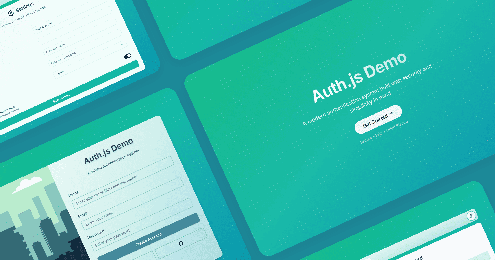

<!-- markdownlint-disable MD033 -->
<!-- markdownlint-disable MD041 -->

  
  <h1 align="center">Auth.js Demo</h1>
  
A Simple Authentication System

   
  
    
  

    
    
    
    
    
    
    
  

 

Auth.js Demo is a simple, functional demo of some of the most important functionalities within Auth.js. Though it presents some of the capabilities of the library, the project's main purpose was to serve as a mini toolbox for authentication. It contains a collection of reusable components, hooks, and utilities to be integrated in some future projects. This demo also acts as a guide or reference for people to understand how Auth.js can be used in many real-world scenarios.

## Features

- **Login Form** - A secure login interface for existing users checks the email and password against stored records. These must match one another and exist in the database. The form further checks the legitimacy of the email by confirming it through email message.

  
See screenshot
 

- **Registration Form** - A user registration form with field validation for name, email, and strong password requirements, made possible by Zod for error handling.

  
See screenshot
 

- **OAuth Integration** - Enables Google and GitHub login and signup to allow users to bypass manual data entry for a faster and more convenient experience.

  
See screenshot
 

- **Forgot Password** - A password recovery feature that enables users to reset their account password if forgotten. The process includes verifying that the user is the legitimate owner of the provided email address.

  
See screenshot
 

- **Two-Factor Authentication** - An extra layer of security requiring two forms of identification to access sensitive data or resources. Users can enable 2FA through the Settings page, where a verification code is sent to their email as the second authentication factor.

  
See screenshot
 

- **Server and Client Page** - Displays user information such as ID, name, email, role, and 2FA status. The server and client pages differ in terms of how data is fetched and presented.

  
See screenshot
 

- **Admin Page** - A page for testing role-based access control, distinguishing between standard user and admin privileges.

  
See screenshot
 

- **Settings Page** - A page for managing and updating user information. Non-OAuth users can modify most of their details, including email and password. However, OAuth users cannot edit their email or password, as these are managed directly through the OAuth provider, bypassing manual input during account creation.

  
See screenshot
 

## Technology Stack

- **Auth.js (formerly known as NextAuth.js)** - A JavaScript library designed for implementing authentication in web applications.
- **Next.js** - A powerful React framework used for building fast and optimized web applications.
- **React** - A JavaScript library made by Facebook primarily used for building user interfaces for web applications.
- **shadcn/ui** - A UI component library specifically designed for building user interfaces in web applications using React.
- **Tailwind CSS** - A utility-first CSS framework that allows for quick and flexible styling using predefined classes.
- **Typescript** - A strongly typed programming language that builds on JavaScript by adding static types.
- **Zod** - TypeScript-first schema declaration and validation library designed to provide a type-safe way to validate JavaScript objects.
